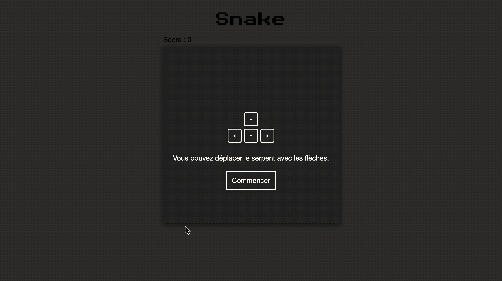
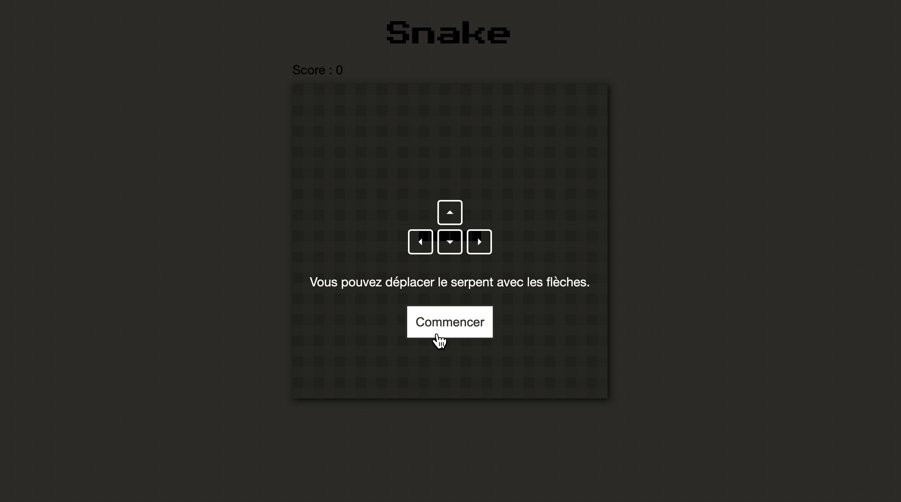
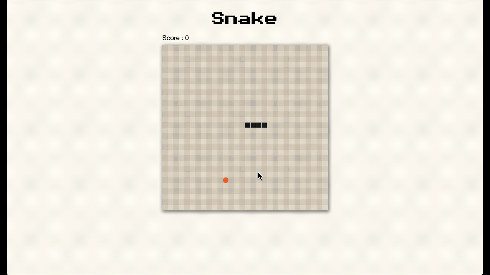
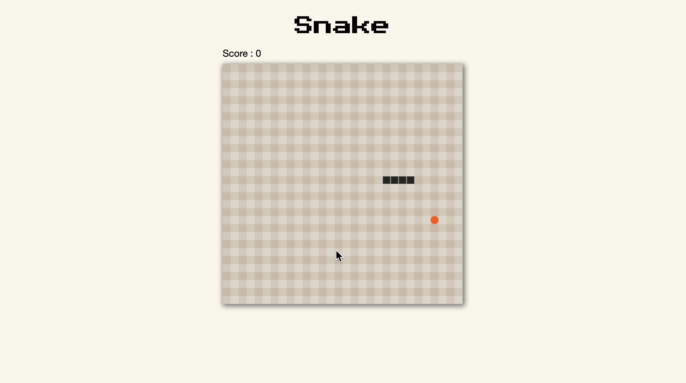
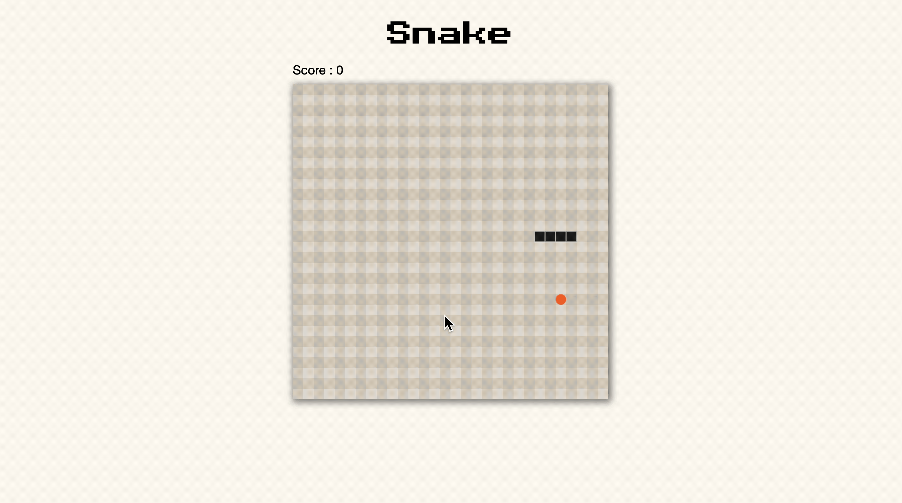
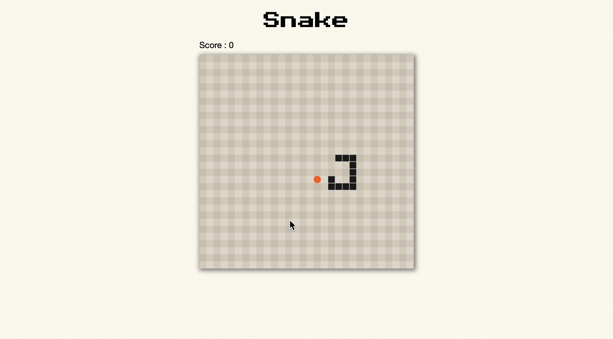
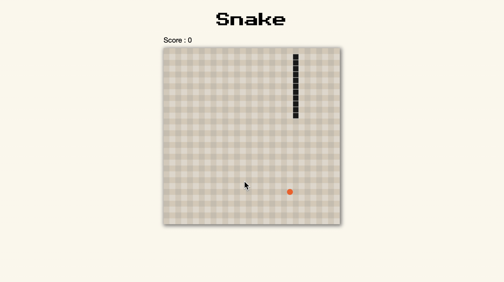
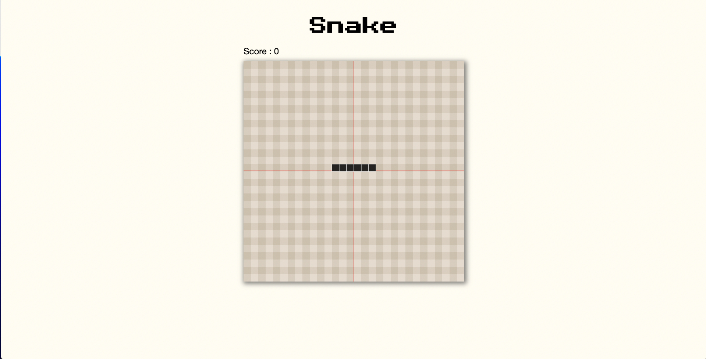

# Snake 🐍

> A JS exercise use at HEPL for MMI.

* * *

**examen-juin-2022** is an educational project, which will be used for `JS` courses.

**Note:** the school where the course is given, the [HEPL](https://hepl.be) from Liège, Belgium, is a French-speaking school. From this point, the instruction will be in French. Sorry.

* * *

Dans le cadre de cet examen, on vous demande de reproduire une version simplifiée du célèbre jeu *[Snake](https://fr.wikipedia.org/wiki/Snake_(genre_de_jeu_vidéo))*.

## Les règles du jeu

* Pour démarrer le jeu (et donc sa boucle d'animation), l'utilisateur soumet le formulaire `.game__play`. Pour le cacher, il suffit de lui ajouter la classe `hide`.

* Le serpent commence son parcours au milieu du canvas. Il se déplace de 20px dans une direction que l’utilisateur peut changer. Gauche, Droite, Bas, Haut. À l’initialisation du jeu, la première direction est arbitrairement définie vers la droite. Au début, le serpent a une taille de 6 unités.

* L'utilisateur peut, avec les flèches du clavier, changer cette direction.
  * Quand le serpent se déplace vers la gauche ou vers la droite, il ne peut pas directement se déplacer dans la direction opposée. Il doit d'abord faire un coup vers le bas ou le haut.
  * Quand le serpent se déplace vers le bas ou vers le haut, il ne peut pas directement se déplacer dans la direction opposée, il doit d'abord faire un coup vers la droite ou la gauche.

  

* Pour grandir et gagner des points, le serpent mange des pommes. (Représenté ici par un cercle.) Quand le serpent passe sur une case avec une pomme, alors il grandit d'une unité. Le score du jeu est incrémenté d'un point.

* Le serpent ne peut pas sortir du cadre. S'il sort, alors le jeu se termine.

* Le serpent ne peut pas se mordre, sinon le jeu se termine également.

* Quand le jeu se termine, le formulaire `.game__play` s'affiche à l'écran. Il faut mettre dans le champ `.game__play__score` le score courant du joueur ainsi qu’un message indiquant la raison de la fin. Ce message doit se trouver dans la balise `p.game__play__message`.

## Contraintes

* Le serpent commence son parcours au milieu du canvas. Ainsi s'il est composé de 6 unités, 3 doivent se trouver dans la première moitié du canvas tandis que les 3 autres doivent se trouver dans l'autre moitié. La position de départ du premier item doit correspondre avec le début d'une colonne. Pour les éléments suivants c'est très simple, il suffit d'augmenter d'une fois la taille d'une unité, 20px.
* La nourriture est générée à une position qui donne l'impression d'être dans une case.
* Le serpent ainsi que la pomme sont des éléments du jeu qui sont capables de s'effacer tout seuls. Il n'est donc pas souhaitable, dans la boucle d'animation, d'effacer l'entièreté du canvas. Il suffit d'appeler la méthode `clear` du serpent qui appelle la fonction `clear` sur chacun des éléments du serpent.

## Contraintes techniques

Comme vous pouvez le voir, il y a déjà un peu de code qui vous est fourni pour vous aider. Vous devez vous servir de ses éléments afin de respecter la structure du jeu définie en classe.

* Vous devez respecter les bonnes pratiques, tant au niveau [de JavaScript](https://github.com/hepl-dcc/dcc-guidelines) que de [TypeScript](https://github.com/hepl-mmi/mmi-guidelines).
* Le taux de rafraichissement est exprimé en image par seconde dans le fichier `settings.ts`. Étant donné que le serpent se déplace de 20 pixels à chaque fois qu'on redessine le serpent, il faut réduire le taux de rafraichissement, sinon il se déplacerait trop vite. Pour commencer, je propose un taux de rafraichissement de quelques images par seconde.
* Le serpent et la nourriture ne se trouvent pas sur le même canvas. Le premier sert à dessiner le serpent, quelques fois par seconde, tandis que le deuxième sert à dessiner les pommes, uniquement au besoin. Notez que dans un premier temps on peut considère qu'il n'y a qu'une pomme à la fois.
* Le score du joueur est mis à jour en manipulant directement le DOM.
* La classe `Animation` permet de gérer la bouche d'animation. La fonction `animate` n'est rappelée qu'après qu'une certaine quantité de temps s'est écoulée.
* L'interface `IDrawable` représente un objet qui peut se dessiner et s'effacer.
* La classe abstraite `Canvas` prépare le terrain pour des classes de filles qui ont besoin d'un *contexte*, d’un *canvas* et d'une *position*.
* La classe `Score` représente le score du joueur. Il est à 0 quand on commence le jeu et s'incrémente à chaque fois que le serpent grandit.
* Dans le dossier `Types` vous retrouvez deux types supplémentaires. D'une part le type `direction` pour définir la direction courante. D'autre part, le type `position` pour représenter les coordonnées `x` et `y` d'un objet.
* Dans le fichier `settings.ts` vous retrouvez tous les paramètres du jeu :
  * Les sélecteurs CSS pour les 2 canvas ainsi que son type.
  * Le taux de rafraichissement pour le serpent, exprimé en images par seconde.
  * La taille en pixel d'une unité du serpent, sa couleur ainsi que le nombre d’unités au démarrage.
  * Le rayon et la couleur du cercle qui représente la nourriture.
  * Les sélecteurs CSS pour le score ainsi que le formulaire pour démarrer le jeu.
